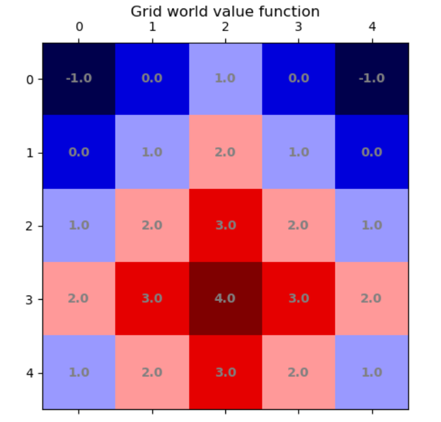
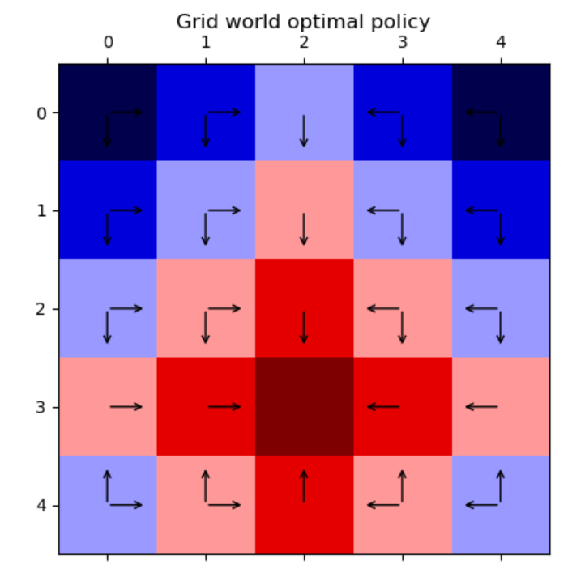
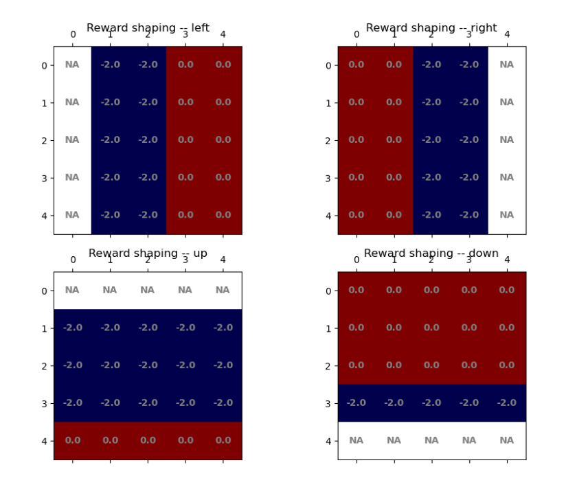

### Simple grid world Markov Decision Process
*** 

#####
* **Rules**  
In a simple **Grid World**, agent can move left, right, up and down, permited that he stays within the board. Each action yield reward of -1, and reaching the goal state brings rewards the agent with number of points equal to the Manhattan distance from starting to the goal field. 

* **Implementation**  
Using the value iteration algorithm, state value function was estimated, and optimal policy visualized.

Additionally, **reward shaping** was used to improve agent's behaviour. 

* **Visualizations**    
  

